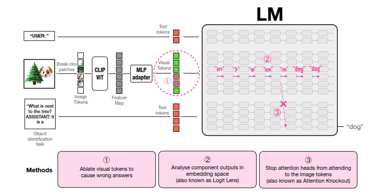
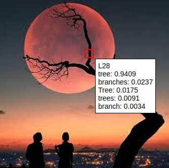
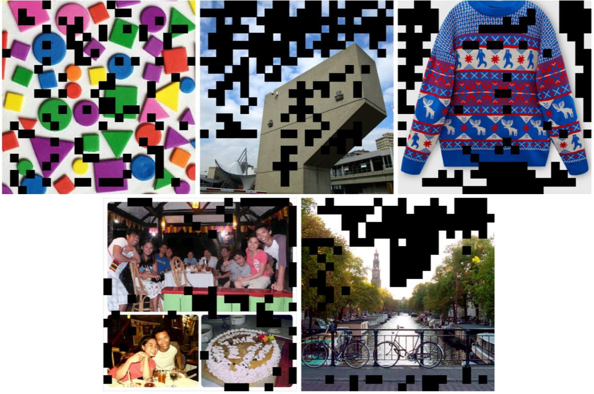
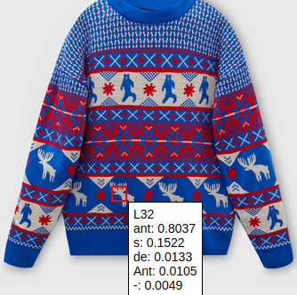
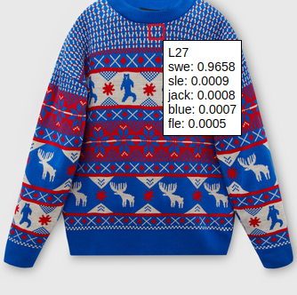

# Multimodal LLM Interpretability

## Table of Contents
- [Multimodal LLM Interpretability](#multimodal-llm-interpretability)
  - [Table of Contents](#table-of-contents)
  - [Installation, Configuration, and Usage](#installation-configuration-and-usage)
    - [Prerequisites](#prerequisites)
    - [Steps](#steps)
  - [Usage](#usage)
    - [1. Logit Lens](#1-logit-lens)
    - [2. Working with the resulting HTML file](#2-working-with-the-resulting-html-file)
    - [3. Analyzing the results](#3-analyzing-the-results)
    - [4. Future research](#4-future-research)
  - [Contacts](#contacts)
  - [References](#references)

## Installation, configuration and usage

### Preliminary requirements
Make sure that you have Python 3.8+ and `pip' installed.

### Steps
1. **Clone the repository:**
   ```bash
   git clone https://github.com/wolkendolf/tlab_MultimodalLLM.git
   cd tlab_MultimodalLLM
   mkdir save_folder
   ```

2. **Install the necessary Python packages:**
    ```bash
    pip install -r requirements.txt
    ```

3. **Run the experiment**
  In my work, I conduct research using the `llava-1.5-7b` model. The following code launches the model and creates an interactive HTML file to illustrate how the logit lens works. If your GPU has less than 16 GB of video memory, use the first line of code; otherwise, use the second. The flag `CUDA_VISIBLE_DEVICES=0,1` specifies the graphics cards that will be used.

    ```bash
    CUDA_VISIBLE_DEVICES=0,1 python3 scripts/create_logit_lens.py --image_folder ./images --save_folder ./save_folder --device auto
    ```
    ```bash 
    python3 scripts/create_logit_lens.py --image_folder ./images --save_folder ./save_folder
    ```

## Usage
In the rapidly evolving landscape of artificial intelligence, multimodal large language models are becoming an important area of interest. These models, which allow different types of input data to be combined, are becoming increasingly popular. However, understanding their internal mechanisms remains a challenging task. In this paper, I explore one approach to analyzing their inner workings: Logit Lens.

### 1. Logit Lens
LLM works with two spaces—the source space (vocab space) and the latent space (embedding space)—with the latent space having a lower dimension. Since our goal is to better understand the processes within a neural network, we would like to be able to extract information from any hidden layer. This is where *Logit lens* comes in handy — a technique for studying the interpretability of LLM that focuses on what LLM “believes” after each processing step, rather than how it updates this belief within the step.

Article [1] provides a good illustration of this method (see number 2 in the image):



The essence is that we look through a “microscope” (‘lens’) at how the model's response (“logit”) changes layer by layer. A more formal description.
Let $L$ be the number of layers in the model. At each layer, the hidden states are transformed:

```math
h^{(l)} = F^{(l)}\bigl(h^{(l-1)}\bigr), \quad l = 1, 2, \dots, L,
```
where the function $F^{(l)}$ includes mechanisms for self-attention, normalization, and position-dependent nonlinear transformations (feed-forward network). The final representation $h^{(L)}$ is used to generate the next token.

The final logits are calculated as the projection of the final representation $h^{(L)}$ into a dictionary space of dimension $V$ using a linear layer specified by a weight matrix $W \in \mathbb{R}^{V \times d}$ (and, if there is a bias, by a vector $b \in \mathbb{R}^{V}$):

```math
z = W\, h^{(L)} + b.
```
The probability distribution over tokens is calculated using the softmax function:

```math
p_i = \frac{\exp(z_i)}{\sum_{j=1}^{V} \exp(z_j)}, \quad i = 1, \dots, V.
```
The idea behind the *logit lens* is to apply the same linear projection $W$ (and bias $b$, if used) to the intermediate representations $h^{(l)}$ for $l < L$. Thus, for each layer $l$, an &laquo;intermediate prediction&raquo; is defined in the form of logits:

```math
z^{(l)} = W\, h^{(l)} + b,
```
and then the corresponding token allocation:

```math
p^{(l)}_i = \frac{\exp(z^{(l)}_i)}{\sum_{j=1}^{V} \exp(z^{(l)}_j)}, \quad i = 1, \dots, V.
```

2. Working with the HTML file
When you hover over an image, a window pops up with info on:
- the layer number where the model is most confident in its answer;
- the top 5 tokens for that layer, based on the “token” : “model confidence in the answer” principle.  
  

When you hover the cursor over a table cell, similar information is displayed.

You can lock the area of interest in the image for analysis with a mouse click. Clicking again unlocks it.

### 3. Analysis of the results
1) The model consistently achieves the highest confidence in the last third of the layers. This can be seen by the layer number when hovering over the image. From this, we can conclude that information about the object is largely localized in tokens corresponding to the spatial location of the object in the original image.

2) I noticed that if the object in the image is elongated, the model gives the most reasonable answers for tokens closer to its border. This may indicate that more significant tokens are located closer to the object's boundary, while less significant ones are located inside its contour. To test my hypothesis, I added a mask over each image, painting black those tokens that the model classifies as an empty string “” (see image). It is clear that the hypothesis has been confirmed: the sky and the background of the objects are heavily painted over. This indicates an uneven distribution of the contribution of different regions of the image: the model “focuses” on the boundaries where the most dramatic changes in features (color, texture, shape) are likely to be observed. <br>


3) Image processing occurs at different scales. This can be seen in the file `llava-1.5-7b-hf_sweater_logit_lens.html`, where one of the tokens is recognized as **ant**-lers (horns) and another as **swe**-ater (sweater). <br>
  
  

4) It can be noted that when decoding, characters other than those in the English alphabet may appear in the initial layers. Closer to the final layers, we always obtain readable text. This effect can be explained by the fact that in the middle layers, the transformer operates in an abstract “concept space” *[2]*, which only in the last layers transitions into the “token space” *[2]* of a specific language, in our case English.

### 4. Future research
- Consider including contour detection algorithms or other boundary extraction methods in the model architecture. If the model really uses boundaries as a key source of information, then explicit extraction of such features can improve both interpretability and recognition quality.
- Test the hypothesis that the model focuses on certain parts of the image in the labeling task using other tools. For example, one of them is presented in article [3], but unfortunately, I was unable to run it. Some of the libraries used were not in pip, and if they were, several functions used were missing.
- Consider methods of analyzing LVLM performance other than *logit lens*, such as “attention knockout” [4], where some tokens are removed to assess their importance.
  

## Contacts
Tg: [@Dan_i_il](@Dan_i_il)

## Links
[1] - [Clement et al. (2024). Towards Interpreting Visual Information Processing in Vision-Language Models](https://arxiv.org/abs/2410.07149) \
[2] - [Wendler et al. (2024). Do Llamas Work in {E}nglish? On the Latent Language of Multilingual Transformers](https://aclanthology.org/2024.acl-long.820/) \
[3] - [Stan et al. (2024). LVLM Interpret: An Interpretability Tool for Large Vision-Language Models](https://intellabs.github.io/multimodal_cognitive_ai/lvlm_interpret/) \
[4] - [Geva et al. (2023). Dissecting recall of factual associations in auto-regressive language models](https://arxiv.org/abs/2304.14767) \
